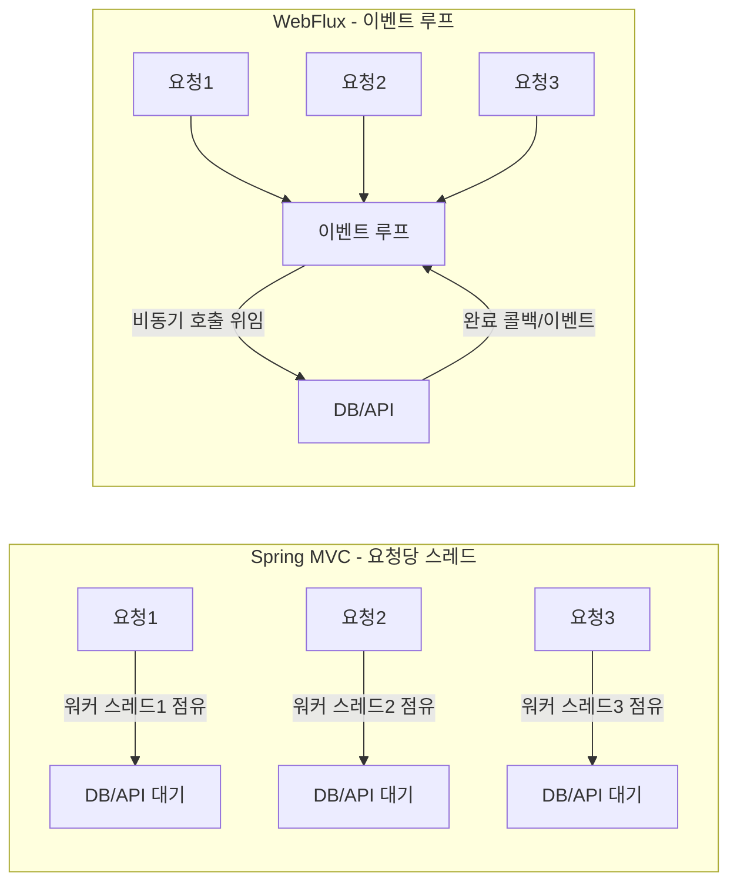
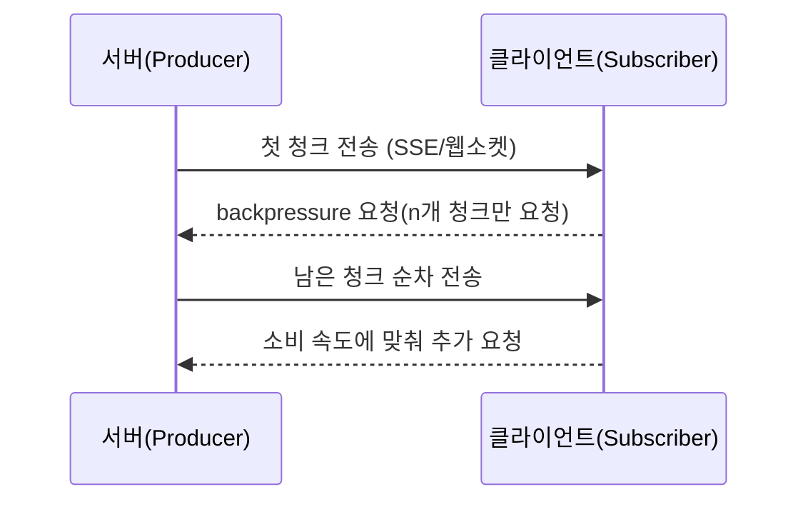

# Spring WebFlux 개요

## 한 줄 요약
- “많은 요청을 비동기로 시원하게 처리하고, 필요하면 데이터를 조금씩 흘려 보내는” 논블로킹 웹 스택.

## 무엇을 위한 스택인가?
- **비동기 논블로킹 웹 스택**: Netty(기본) 또는 서블릿 컨테이너(톰캣/제티) 위에서 리액티브 방식으로 HTTP 요청을 처리.
- **높은 동시성·IO 효율**: 이벤트 루프가 블로킹 없이 요청을 떠넘기고, IO 완료 시 콜백으로 이어 받아 처리하므로 요청당 전용 스레드가 필요 없다. DB나 외부 API 응답을 기다리는 동안 스레드가 놀지 않으니 같은 스레드 수로 더 많은 요청을 처리할 수 있다.
- **스트리밍 친화적**: `Flux` 기반 SSE/웹소켓/청크 전송을 자연스럽게 지원, 백프레셔로 소비 속도 제어 가능.

## 왜 동시성이 높은가?
- **요청당 스레드 모델이 아님**: MVC처럼 “요청 1개 → 스레드 1개 할당”이 아니라, 소수의 이벤트 루프 스레드가 수천 개 요청을 왕복 처리한다.
- **블로킹 시간=낭비가 아니다**: 외부 API/DB 응답을 기다리는 동안 스레드가 점유되지 않고 풀로 반환되므로, 같은 스레드 수로 더 많은 요청을 커버한다.
- **백프레셔·스트리밍 결합**: 스트리밍 중에도 소비자 속도에 맞춰 흘려보내므로 과도한 버퍼링 없이 안정적인 처리량을 유지한다.
- **언제 체감되나?** 대기 시간이 큰 IO가 많은 서비스(LLM 스트리밍, 외부 API 팬아웃, 느린 DB/캐시)일수록 요청당 대기 시간이 길어지는데, 논블로킹 구조는 이 대기 시간을 스레드 낭비로 전환하지 않아 동시 처리량을 유지한다.

### 스레드 모델 그림 (MVC vs WebFlux)


### 스트리밍/백프레셔 흐름 그림


### 스레드 종류와 역할 (WebFlux)
- **이벤트 루프(NIO worker)**: 네트워크 이벤트 감지/콜백 처리. 수는 코어 수준의 소수(기본 Netty 설정).
- **작업 스케줄러(옵션)**: CPU 바운드/블로킹 작업을 격리할 때 `boundedElastic`/`parallel` 등 별도 스레드 풀을 사용. 이벤트 루프가 블로킹되지 않도록 분리하는 것이 핵심.

## MVC와의 차이
- **프로그래밍 모델**: `Mono`/`Flux`(Project Reactor) 리액티브 타입 사용. MVC는 `@Controller` + 동기 반환(또는 `DeferredResult` 등) 중심.
- **스레드 모델**: WebFlux는 이벤트 루프(NIO) 기반, 블로킹 호출이 적어야 함. MVC는 요청당 스레드 모델로 블로킹 작업에 친화적.
- **호환성**: 두 스택은 애플리케이션 내에서 함께 쓸 수 있지만, 컨트롤러/핸들러는 각각의 실행 모델을 따름.

## 언제 유리한가?
- **LLM/채팅/알림 스트리밍**: 토큰·이벤트 단위로 바로바로 흘려보낼 때.
- **외부 호출 많은 서비스**: 여러 API/DB 호출로 대기 시간이 길 때 스레드 낭비를 줄이고 싶을 때.
- **속도 맞추기(백프레셔)**: 소비자가 느리면 천천히, 빠르면 빨리 보내야 할 때.

## 언제 굳이 안 써도 되는가?
- 블로킹 JDBC 중심의 단순 CRUD 서비스: Spring MVC가 더 쉽고 익숙.
- 팀이 리액티브 연산자/스케줄러에 익숙하지 않아서 복잡도가 이점을 상쇄할 때.

## 기본 개념/구성 요소
- **리액터 타입**: `Mono<T>`(0~1), `Flux<T>`(0~N). 연산자(map/flatMap/filter/collect 등)로 비동기 파이프라인 구성.
- **핸들러/컨트롤러**: `@RestController`에서 `Mono<T>`/`Flux<T>` 반환, 또는 함수형 라우터/핸들러(`RouterFunction`, `HandlerFunction`).
- **백프레셔**: 구독자가 요청한 만큼만 발행. 필요 시 `limitRate`, `onBackpressureBuffer/Drop/Latest` 등으로 제어.
- **스케줄러**: CPU 바운드 작업은 `publishOn(Schedulers.parallel())`, 블로킹 호출은 `subscribeOn(Schedulers.boundedElastic())`로 격리.

## SSE/스트리밍 예시 (토큰/이벤트 단위)
```java
@GetMapping(value = "/chat/stream", produces = MediaType.TEXT_EVENT_STREAM_VALUE)
public Flux<ServerSentEvent<String>> stream(@RequestParam String message) {
    return streamingChatClient.stream(buildPrompt(message))
        .map(resp -> resp.getResult().getOutput().getContent())
        .map(token -> ServerSentEvent.builder(token).build());
}
```
- 초기 바이트를 빠르게 전달해 체감 지연을 줄이고, 긴 응답도 점진적으로 표시 가능.

## 응답을 받는 방식 (한눈에)
- **Mono<T> (한 번에)**
  - 처리 끝나면 한 번에 반환
  - 예: `Mono<ResponseEntity<Foo>>` → JSON 한 방에 수신
- **Flux<T> (조각조각)**
  - 준비되는 대로 순차 전송
  - 예: `Flux<ServerSentEvent<String>>` → 토큰/이벤트 스트림
- **백프레셔**
  - 구독자가 “n개만” 요청 → 그만큼만 보냄
  - 느린 소비자 보호, 버퍼 폭주 방지
- **종료/에러 신호**
  - 흐름: `onNext*` → `onComplete`(정상) / `onError`(예외)
  - 예외 시 `onErrorResume` 등으로 대체 응답 가능

## 블로킹 연동 시 주의
- JDBC, RestTemplate 등 블로킹 I/O는 이벤트 루프를 점유하므로 지양. 필요 시 `Schedulers.boundedElastic()`으로 격리하거나, R2DBC/WebClient 등 논블로킹 클라이언트 사용.

## 테스트/관측
- `WebTestClient`로 비동기 핸들러를 빠르게 테스트 가능.
- Micrometer로 요청 지표, 백프레셔/큐 잔고, 스레드 풀 사용량 등을 모니터링.

## 요약
- WebFlux는 “소켓 통신을 위한 것”이 아니라, **논블로킹·리액티브 모델로 높은 동시성과 스트리밍을 효율적으로 처리**하기 위한 스택이다. 필요 시 MVC와 병행 가능하지만, 블로킹 연동 시 이벤트 루프 점유를 피하도록 주의해야 한다.
